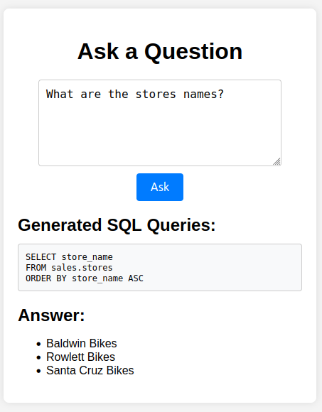

# Sistema SQL de Perguntas e Respostas

Esse repositório contém o código de um sistema de perguntas e respostas SQL, que se conecta a um banco de dados e responde perguntas de usuários sobre uma base dados relacional através do input em uma interface gráfica web.



## Projeto

Aqui estão enunciados alguns detalhes do projeto.

### Objetivo

Produzir um agente de IA que seja capaz de responder perguntas de funcionários de uma empresa com base em um banco de dados (Data Warehouse).​

### Fluxo do Sistema de IA

O sistema deve ser capaz de receber uma pergunta do usuário e identificar através dos detalhes de uma base de dados, quais tabelas e colunas são necessárias para respondê-la. 

O modelo saberá assim gerar uma query SQL, que deve ser executada no banco de dados, retornando a informação desejada.

No último passo o modelo irá, a partir da pergunta inicial e do retorno do resultando da consulta ao banco, gerar a resposta final para a pergunta do usuário.

Um fluxo pode ser visto na imagem:


### Stack

A stack escolhida foi:

1. Python: linguagem de programação
   - Flask: framework para geração do web server com interface gráfica para interação com o LLM.
   - Jupyter notebook: para testes diversos das funcionalidades do sistema.
   - Dataset: biblioteca para conexão e execução de comandos no banco de dados
   - OpenAI SDK: biblioteca da OpenAI usada para interações com diversos LLMs.
2. SQL Server: tipo de banco de dados SQL escolhido para guardar a dados da base de dados bikeStores.
3. OpenRouter API: plataforma de APIs para interagir com diversos modelos gratuitos e pagos.
4. DeepSeek R1 free: modelo LLM utilizado pelo sistema.


Dessa forma, o sistema funcionará dessa forma:

1. Back-end: Flask, OpenAI SDK e Dataset.
2. Front-end: html e javascript.
3. Persistência de dados: SQL Server.
4. Serviços externos: OpenRouter API.

### Organização dos Serviços

Todos os testes e desenvolvimentos foram efetuados utilizado o Docker, através da construção de serviços no Docker Compose.

Os serviços criados e suas utilizações foram:

1. Jupyter: serviço usado para subir em localhost jupyter notebooks com as bibliotecas necessárias instaladas. Esse serviço foi utilizado apenas para testes.
2. Sqlserver: serviço do banco de dados SQL Server em localhost.
3. Mssqltools: serviço temporário para criação da base de dado no SQL Server.
4. Flask: serviço principal que integra os sistemas anteriores. Possuindo uma interface gráfica e um servidor em localhost.

### Base de Dados

A base de dados escolhida foi uma com dados de uma loja de bicicletas denominada "bikeStores".

Na seguinte imagem é possível ver as tabelas presentes nesse banco de dados:


Para que o modelo pudesse saber detalhes da configuração do banco de dados, foi criado um prompt que está localizado no arquivo services/flas/app/model.py.

## Interface Gráfica

A interface gráfica em localhost pode ser vista na seguinte figura:


### Testes Efetuados

Na pasta jupyter_data, estão os notebooks utilizados para construir e testar as funcionalidades do sistema.

1. Testes de conexão com o banco de dados SQL Server: database_connection.ipynb.
2. Testes com a API do Open Router: open_router.ipynb.
3. Teste do fluxo completo: integrated_test.ipynb.

Foram construídas duas classes principais: a Database, para conectar e executar comandos no banco de dados, e a Model para interagir com o modelo de linguagem.

## Resultados

A avaliação do sistema se baseou em testes do funcionamento completo do sistema, isto é, a inserção da pergunta pelo usuário, a geração das queries (podendo ser mais de uma) pelo modelo, a conexão com o banco e a execução dessas queries, e por fim, o recebimento pelo LLM da pergunta inicial e da resposta do banco, gerando a resposta final.

O arquivo questions_and_answers.txt, contém os testes efetuados e as análises dos resultados. 

Abaixo está uma com entradas e saídas do modelo:

| **Question** | **SQL** | **Answer** |
|--------------|---------|------------|
| **What are the top 3 products in stock quantity?** | ```SELECT TOP 3 p.product_name, SUM(s.quantity) AS total_quantity FROM production.stocks s INNER JOIN production.products p ON s.product_id = p.product_id GROUP BY p.product_name ORDER BY total_quantity DESC;``` | - Electra Townie Original 7D - 2017 (125 units in stock)<br> - Electra Townie Balloon 8D EQ Ladies' - 2016/2017/2018 (121 units in stock)<br> - Electra Townie Go! 8i - 2017/2018 (120 units in stock) |
| **What are the top 3 products in sales quantity?** | ```SELECT TOP 3 p.product_name, SUM(oi.quantity) AS total_quantity FROM sales.order_items oi JOIN production.products p ON oi.product_id = p.product_id GROUP BY p.product_id, p.product_name ORDER BY total_quantity DESC;``` | - Surly Ice Cream Truck Frameset - 2016<br> - Electra Cruiser 1 (24-Inch) - 2016<br> - Electra Townie Original 7D EQ - 2016 |
| **What were the staffs with the highest number of sales in August of 2017 and what is the number of products that it sold at this month?** | ```SELECT TOP 1 WITH TIES s.staff_id, s.first_name, s.last_name, SUM(oi.quantity) AS total_products_sold FROM sales.staffs s JOIN sales.orders o ON    s.staff_id = o.staff_id JOIN sales.order_items oi ON o.order_id = oi.order_id WHERE o.order_date >= '20170801' AND o.order_date < '20170901' GROUP BY s.staff_id, s.first_name, s.last_name ORDER BY total_products_sold DESC;``` | In August 2017, the staff with the highest number of sales was: Marcelene Boyer, who sold 91 products during that month. |

O único erro cometido pelo modelo foi pelo fato da base de dados possuir uma tabela de produtos com produtos de diferentes ids, mas com mesmo nome. Dessa forma, agrupar pelo ID gera um resultado diferente de agrupar pelo nome.

O agrupamento do modelo pelo ID não necessáriamente é uma falha do modelo, podendo indicar uma falha da construção da própria base de dados. Porém, caso o modelo tivesse conhecimento disso, através de uma query SELECT, ele poderia ter gerado o resultado correto.

Uma possível correção seria uma avaliação completa do modelo de todo o banco de dados, antes dele receber qualquer pergunta. Isto é, o modelo poderia gerar queries automáticas de avaliação para gerar um conhecimento das especificidades das informações do banco de dados. Porém, essa avaliação seria muito complicada para o caso de base de dados muito grandes, com milhões de linhas, e talvez pequenas amostras não evidenciassem os importantes detalhes das informações. 

Uma solução para esse problema seria a geração de um prompt para explicar os detalhes da base e qualquer informações que vá ajudar o modelo a chegar na resposta correta.

## Conclusão

O sistema construído apresentou um excelente desempenho, surpreendendo na precisão das respostas fornecidas. Houve apenas uma resposta que causou dúvidas, devido ao fato da própria base de dados apresentar uma inconsistência, conforme o explicado na seção de resultados.

Adicionando, esse projeto utilizou uma base de dados com a tecnologia do SQL Server, porém, pode ser adaptado para outros dialetos SQL, como por exemplo, MySQL e Postgres. Além disso, vale mencionar, que o modelo tomou conhecimento das tabelas, campos e relacionamentos através de um prompt, ou seja, ao modelo foi fornecido um contexto e ele o utilizou para gerar as consultas em SQL. Base de dados muito grandes e complexas podem necessitar de outras técnicas e o RAG pode ser empregado para que não seja necessário previamente um processamento de tokens extenso, evitando romper o limite de contexto do modelo LLM utilizado.

Um outro ponto importante fato a ser citado, é que a utilização do OpenRouter (plataforma que disponibiliza API para diversos modelos) permitiu a utilização de um modelo de ponta de forma gratuita, porém ao mesmo tempo, o tempo de resposta do modelo foi alto, podendo demorar mais de 1 minuto para gerar as respostas necessárias.

O projeto demonstra o poder dos LLMs, pois mesmo pessoas que não conhecem SQL podem extrair insights dos dados de um banco SQL, sem necessariamente precisar saber sobre essa linguagem de script.